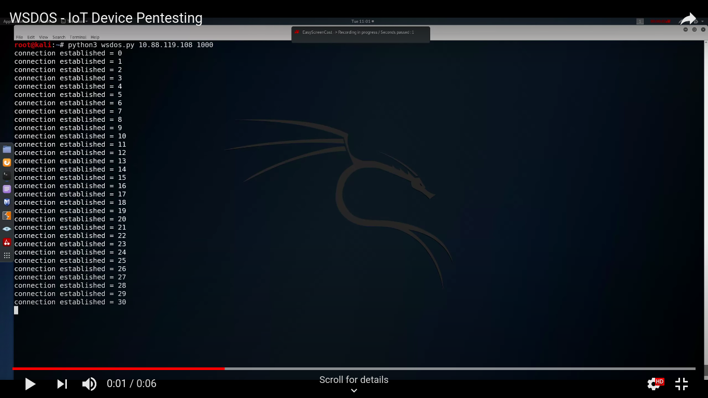

## wsdos

websocket communication in IoT devices is common and multiple connection requests sends to device to get freezing the device

-------------------------------------------------------------------------------------

Usage:
- > python3 wsdos.py 10.88.119.108 1000
- > python3 wsdos.py <IP Address> <no.of requests>

-------------------------------------------------------------------------------------

